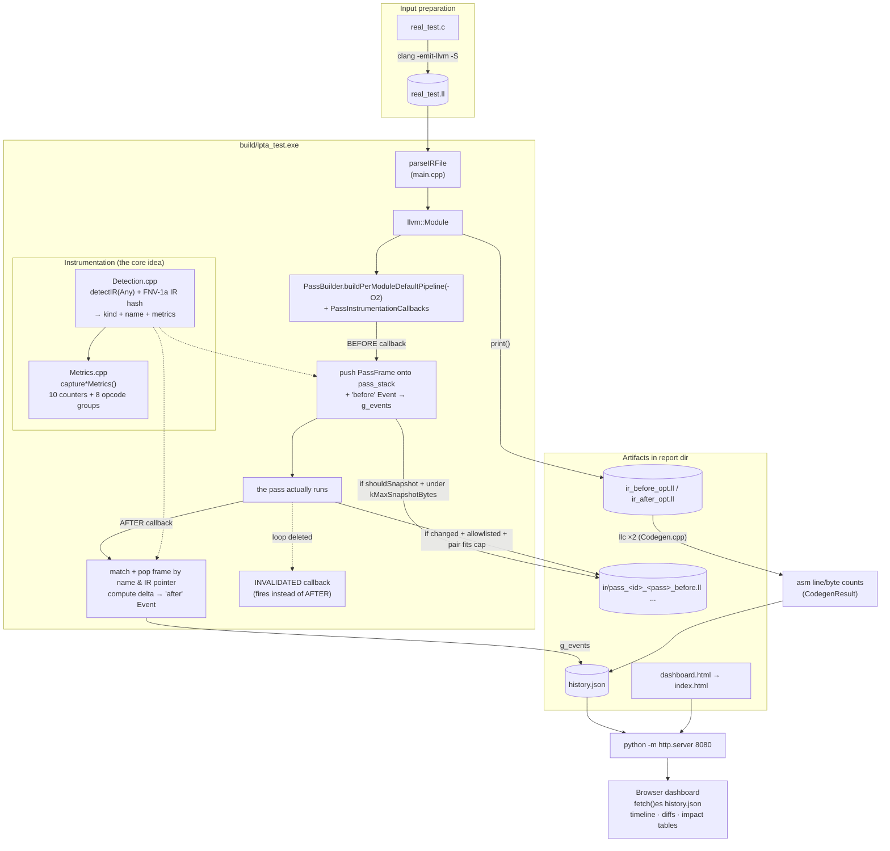
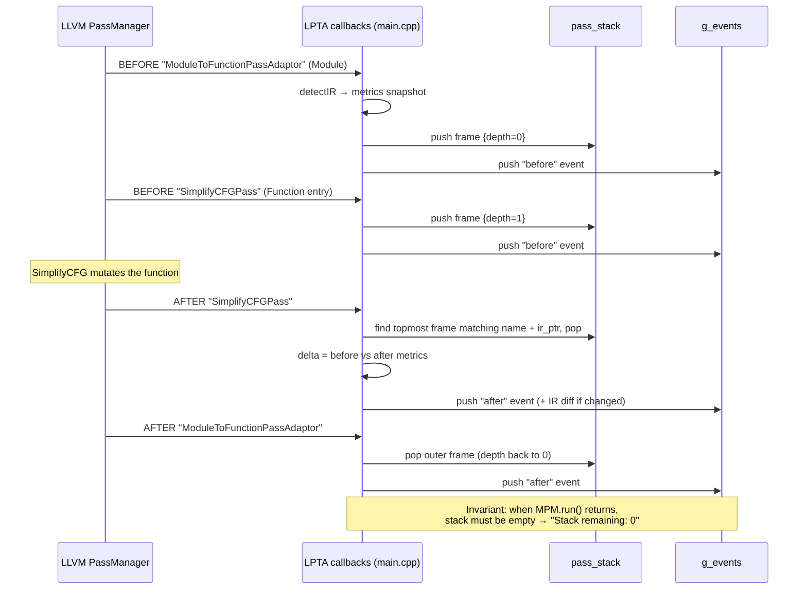

# LPTA — LLVM Pass Transformation Analysis

A tool that makes LLVM's optimization pipeline transparent by recording before/after metrics for every pass, detecting real IR changes via hashing, and presenting the results as an interactive dashboard.

## The Problem

When you run `clang -O2`, LLVM applies dozens of optimization passes internally. You see the input and the output, but you have no idea what happened in between. Which passes ran? What did each one change? How significant was it? How did it affect final codegen?

LLVM provides individual debugging options (`-print-before-all`, `-debug-pass-manager`), but developers still lack a **unified view** that correlates which pass changed the IR, what changed, and how significant that change was.

## What LPTA Does

```
Input: LLVM IR (.ll file)
  ↓
LPTA runs the LLVM optimization pipeline (configurable: -O0 to -Oz)
  ↓
Instruments every pass execution via LLVM's PassInstrumentationCallbacks
  ↓
Records before/after metrics for each pass + hashes IR to detect real changes
  ↓
Computes structural metrics and deltas
  ↓
Saves before/after IR text for allowlisted passes that changed the IR
  ↓
Measures final codegen size impact via llc (a size proxy, not a benchmark)
  ↓
Generates structured JSON + interactive HTML dashboard
```

## How to Use — Complete CLI Reference

### Prerequisites

- LLVM 22.1.8 with `clang-cl` (other LLVM 17+ installs may work but are untested —
  LLVM's C++ pass APIs are version-sensitive, so mismatches can fail the build)
- CMake 3.20+
- Ninja (required by `run_lpta.sh`; direct CMake builds may use other generators)
- A C++17 compiler (Clang recommended)
- Windows: Git Bash / MSYS2 (for `bash run_lpta.sh`, tests)
- Linux (community-verified on Ubuntu 24.04): LLVM 22 from `apt.llvm.org`
  (`llvm-22`, `llvm-22-dev`, `clang-22`, `lld-22`) plus `libzstd-dev`,
  `libedit-dev`, `libcurl4-openssl-dev`; test scripts resolve the extensionless
  `build/lpta_test` binary automatically. Native build is Windows-first;
  `src/Codegen.cpp` includes `<unistd.h>` on POSIX for `readlink` discovery.

> **Where LLVM comes from:** this workspace ships a prebuilt
> `clang+llvm-22.1.8-x86_64-pc-windows-msvc/` toolchain that `run_lpta.sh` and
> the test scripts auto-detect. It is **not tracked in git** (too large —
> see `.gitignore`), so a fresh clone needs either that directory restored
> next to the repo or `LLVM_DIR` pointed at a compatible install:
> ```bash
> export LLVM_DIR=C:/path/to/llvm   # must contain lib/cmake/llvm
> bash run_lpta.sh input.ll
> ```

> **Input:** LLVM IR (`.ll`) is analyzed directly; C/C++ (`.c`/`.cpp`/...) passed to
> `run_lpta.sh` is first compiled to IR with clang (see `CLANG` / `LPTA_CFLAGS`
> below). The `lpta_test` binary itself takes only `.ll` — compile C first:
> ```bash
> clang -O2 -S -emit-llvm real_test.c -o input.ll   # or use bundled clang
> # bundled: clang+llvm-22.1.8-x86_64-pc-windows-msvc/bin/clang.exe
> # real_test.ll is already compiled from real_test.c in this repo
> # ...or let run_lpta.sh do it:  bash run_lpta.sh real_test.c --snapshots
> ```
> **Windows-only:** uses `clang-cl` + Ninja + `.exe` (see `CMakeLists.txt`). Tests require Git Bash/MSYS (`dd`, `timeout`, `sed`).

### 1. One-Command Build & Run (Recommended)

```bash
# From repo root (.ll analyzed directly, .c compiled via clang first)
bash run_lpta.sh input.ll [--snapshots]
bash run_lpta.sh prog.c -Os --snapshots
```

**Environment variables (optional):**
```bash
export LLVM_DIR=/path/to/llvm          # if not auto-detected (bundled auto-found via llvm-config)
export BUILD_DIR=./build               # default
export REPORT_DIR=./report             # default
export CLANG=/path/to/clang            # C/C++ compiler (default: bundled clang, else PATH)
export LPTA_CFLAGS="--target=arm-none-eabi -mcpu=cortex-m4 -IDrivers -DSTM32F407xx"
                                       # flags for the .c -> IR step (default: -O0)
```

**What it does:**
1. Configures CMake with bundled LLVM (or your `LLVM_DIR`)
2. Builds `lpta_test.exe` via Ninja
3. `.c`/`.cpp` input? Compiles it to IR (`build/lpta_input_<name>.ll`) via clang
4. Runs LPTA on the IR → `./report/`
5. Copies `dashboard.html` → `./report/index.html`

> **Note:** `build/` is pre-configured (Ninja + clang-cl, `LLVM_DIR` → bundled distro) — just `ninja` inside `build/` if you already built once. Fresh configure only needed after `rm -rf build/`.

**Output:**
- `./report/history.json` — full trace
- `./report/index.html` — open in browser (needs HTTP server)

Or use the build script with explicit LLVM:
```bash
export LLVM_DIR=/path/to/llvm
bash run_lpta.sh input.ll
```

### 2. Direct Binary Usage (After Build)

```bash
# From repo root (after building)
./build/lpta_test.exe input.ll [report_dir] [-O0|-O1|-O2|-O3|-Os|-Oz] [--snapshots] [--targets=...]
```

#### Arguments

| Argument | Description |
|----------|-------------|
| `input.ll` | **Required.** Path to LLVM IR file (`.ll`). Not C source. |
| `report_dir` | Optional. Output directory (default: `./report`). |
| `-O0`..`-Oz` | Optimization level (default: `-O2`). Must be exactly one of: `-O0`, `-O1`, `-O2`, `-O3`, `-Os`, `-Oz`. |
| `--snapshots` | Enable IR text snapshots for passes that change IR. Increases `history.json` size. |
| `--targets=common` | Cross-target codegen: x86_64, aarch64, riscv64 presets. |
| `--targets=triple1,triple2` | Comma-separated LLVM target triples. |
| `--targets=@file.txt` | Read triples from file (one per line, `#` comments allowed). |
| `--` | End of flags: following args are treated as paths even if starting with `-`. |

#### Examples

```bash
# Basic -O2 analysis
./build/lpta_test.exe test.ll report -O2

# With IR snapshots (for diff view in dashboard)
./build/lpta_test.exe test.ll report -O2 --snapshots

# Cross-target codegen comparison (3 presets)
./build/lpta_test.exe test.ll report -O2 --targets=common

# Custom targets
./build/lpta_test.exe test.ll report -O2 --targets=x86_64-pc-windows-msvc,aarch64-unknown-linux-gnu

# From file (targets.txt contains triples, one per line)
./build/lpta_test.exe test.ll report -O2 --targets=@targets.txt
```

### 3. View the Dashboard

The dashboard is static HTML — **must be served via HTTP** (fetch fails on `file://`).

#### Option A: Bundled server (recommended — enables AI + Compare tab)
```bash
cd report
python ../serve_dashboard.py . -p 8080
# Open http://localhost:8080
```

#### Option B: Python stdlib (no AI, no Compare tab — use `--compare` CLI instead)
```bash
cd report
python -m http.server 8080
# Open http://localhost:8080
```

#### Dashboard Navigation
| Key | Page |
|-----|------|
| `1` | Overview (summary, charts, story) |
| `2` | Pipeline Timeline |
| `3` | Function Impact |
| `4` | Pass Explorer (filterable, click for IR diff) |
| `5` | Compare Runs (load two `history.json` files) |
| `Esc` | Close modals / AI drawer |

### Optional: AI Insights via NVIDIA NIM

The dashboard has a built-in **Ask AI** panel (chat, one-click presets, and per-pass
"Explain this change" in every IR diff) powered by free models from
[build.nvidia.com](https://build.nvidia.com). It is fully optional — the dashboard works
identically without it.

```bash
# 1. Get a free key (nvapi-...) at https://build.nvidia.com/settings/api-keys
# 2. Export it (never commit it):
export NVIDIA_API_KEY=nvapi-...        # Windows: set NVIDIA_API_KEY=nvapi-...
# 3. Serve the report with the bundled server instead of http.server:
python serve_dashboard.py report -p 8080
```

- Model/endpoint are switchable without code changes: `LPTA_AI_MODEL`, `LPTA_AI_BASE_URL`
  (any OpenAI-compatible endpoint works).
- The panel supports free-text chat with markdown-formatted answers, a **stop button** for
  in-flight generations, and **chat history**: conversations are kept per module+pipeline
  (in the browser's localStorage), switchable via chips, with "＋ New chat" to start fresh.
- Privacy: nothing leaves your machine until you click an AI control; requests carry only
  aggregate metrics plus the IR excerpt of the single pass you asked about. The API key
  stays in the server process environment — the browser never sees it.
- No key set → the panel shows setup instructions; everything else is unaffected.

### 4. Cross-Run Comparison (Regression Investigation)

The **Compare** page (key `5`) loads two `history.json` files and computes:
- Summary delta (instructions, BBs, codegen, invalidated)
- Per-target codegen comparison with explicit states (`comparable`, added/removed targets, per-side errors — never zero-filled)
- Per-pass presence (did it execute?) kept separate from pass effect (did it change IR?)
- Auto-detected regressions (>5% instruction/codegen increase)

> **Regression risk score (0–100, higher = worse):** a heuristic triage aid, not a
> benchmark. Identical reports score exactly `0` (`unchanged`); improvements-only
> also scores `0` (`improved`). Components: instructions `40·clamp(max(0,pct)/50)`,
> codegen `30·clamp(max(0,pct)/50)`, pass effects `min(20, 10·high + 3·medium)`,
> measurement quality `min(10, 5·errored targets)` — all percentages rounded to
> one decimal (half away from zero), all counts from severities. Verdicts:
> `0` unchanged/improved, `1–60` mixed, `>60` regressed (CLI exits 1 on
> regressed, 2 when the pair is incomparable). Percentages use one definition
> everywhere: `100·(new−old)/old` (1 decimal); a zero baseline with nonzero
> current is *unavailable*, reported as an absolute delta only. The same
> contract is implemented twice — `src/main.cpp` (`--compare`, plus `--json`
> for the canonical machine-readable result) and `serve_dashboard.py`
> (`/api/compare`) — keep them byte-equivalent via `tests/compare_golden/`.

Reports carry `schema_version` plus `run_metadata` (input hash, module id,
LLVM/LPTA versions, pipeline, triple, snapshot flag, requested targets).
Comparing reports from different inputs is blocked unless overridden
(CLI `--allow-different-input`, API `allow_different_input`); version,
pipeline, and target-set drift produce warnings.

#### Workflow
```bash
# 1. Baseline run (e.g., before change)
./build/lpta_test.exe input.ll report_baseline -O2 --snapshots

# 2. Current run (e.g., after change)
./build/lpta_test.exe input.ll report_current -O2 --snapshots

# 3. Open dashboard, go to Compare tab
cd report_current
python ../serve_dashboard.py . -p 8080
# Load report_baseline/history.json as Baseline
# Load report_current/history.json as Current
# Click "Run Comparison"
```

### 5. Build from Scratch (Manual)

```bash
# From repo root — if build/ already exists, just run:
cd build && ninja

# Fresh configure (after rm -rf build or first clone):
mkdir build
cd build
cmake -G Ninja \
  -DLLVM_DIR=../clang+llvm-22.1.8-x86_64-pc-windows-msvc/lib/cmake/llvm \
  -DCMAKE_CXX_COMPILER=../clang+llvm-22.1.8-x86_64-pc-windows-msvc/bin/clang-cl.exe \
  ..
ninja
```

> **`llc` discovery at runtime:** `LLVM_DIR` env → exe dir → parent → sibling bundled dirs → common paths → `PATH` (`src/Codegen.cpp:58-129`); no `PATH` setup needed.

Outputs:
- `build/lpta_test.exe` — main tool
- `build/test_utilities.exe` — unit tests

### 6. Run Tests

```bash
# Fast gate (unit + proof + cross-validation, seconds)
ctest --test-dir build

# Full test suite (slow, includes 300-iteration fuzz)
bash tests/run_all_tests.sh build/

# Fast correctness check (hand-verified tiny_proof.ll)
bash tests/judge_proof.sh build/

# Cross-validation against opt output + independent counting
bash tests/validate_correctness.sh build/ test.ll

# Unit tests only
./build/test_utilities.exe
```

### 7. Common Input Files in Repo

| File | Description |
|------|-------------|
| `test.ll` | 5 tiny functions, minimal IR |
| `real_test.c` | 9 realistic functions (loops, calls, math) |
| `real_test.ll` | Pre-compiled from `real_test.c` with bundled clang |
| `tests/tiny_proof.ll` | 2 functions, 12 instructions — hand-countable ground truth |

### 8. Key Invariants (Don't Regress)

- Exit code `1` on missing/bad input or unknown flag; `0` on success (empty `.ll` = success)
- Must print `Stack remaining: 0` — PassFrame stack balances
- Same input → byte-identical `history.json` (determinism)

### 9. Environment Variables & Config File Reference

| Variable | Purpose |
|----------|---------|
| `LLVM_DIR` | Path to LLVM install (for CMake config + `llc` discovery) |
| `NVIDIA_API_KEY` | Enables AI Insights panel (**never committed** — keeps repo private) |
| `LPTA_AI_MODEL` | Override model (default: `nvidia/nemotron-3-ultra-550b-a55b`) |
| `LPTA_AI_BASE_URL` | Override endpoint (any OpenAI-compatible) |

**AI config file (std-lib only, no deps):** `serve_dashboard.py` loads `.lpta_config.json` from `cwd` then `home` (cwd wins), env vars override file. Example:
```json
{
  "NVIDIA_API_KEY": "nvapi-...",
  "LPTA_AI_MODEL": "nvidia/nemotron-3-ultra-550b-a55b",
  "LPTA_AI_BASE_URL": "https://integrate.api.nvidia.com/v1"
}
```
No key → panel shows setup hint (`fetch /api/health`), rest of dashboard unaffected. Key lives only in server process env — never sent to browser.

### 10. Quick Reference Card

```bash
# Typical daily workflow (input MUST be .ll)
bash run_lpta.sh my_input.ll --snapshots
# → wait for build + run (Stack remaining: 0 must appear)
cd report
python ../serve_dashboard.py . -p 8080
# → open http://localhost:8080 (file:// fails — must be http)
```

```bash
# Compare two runs
./build/lpta_test.exe input.ll baseline -O2 --snapshots
./build/lpta_test.exe input.ll current -O2 --snapshots
# → open dashboard, use Compare tab
```

```bash
# Debug a specific pass
# 1. Run with --snapshots
# 2. Dashboard → Passes tab → click any changed pass
# 3. IR diff modal shows before/after with line highlights
```

### Troubleshooting

| Issue | Fix |
|-------|-----|
| `LLVM_DIR not set` | `export LLVM_DIR=/path/to/llvm` or use bundled |
| `clang-cl.exe not found` | Use bundled: `../clang+llvm-22.1.8-.../bin/clang-cl.exe` |
| Dashboard shows "Could not load history.json" | Serve via HTTP (`python -m http.server`), not `file://` |
| "Stack remaining: N (WARNING)" | PassFrame stack imbalance — bug in pass matching |
| Cross-target fails | Ensure `llc` is in PATH or LLVM_DIR (bundled works) |
| Compare tab shows "backend not reachable" | Serve with `python serve_dashboard.py` (not plain `http.server`), or use `./build/lpta_test.exe --compare base.json curr.json` |
| Garbled `history.json` / missing snapshots | One run per report directory at a time — concurrent runs into the same dir corrupt each other's outputs |
| AI panel shows "no backend" | `export NVIDIA_API_KEY=nvapi-...` then restart server |

### Files You'll Generate

After running LPTA on `input.ll` with output dir `report/`:
```
report/
├── history.json          # Main output — all events, metrics, IR diffs
├── index.html            # Dashboard (copy of dashboard.html; run_lpta.sh only)
├── ir_before_opt.ll      # Module IR before pipeline
├── ir_after_opt.ll       # Module IR after pipeline
├── codegen_before.s      # Assembly before (native target)
├── codegen_after.s       # Assembly after (native target)
├── codegen_<triple>_before.s / _after.s  # Per-target assembly (--targets)
└── ir/                   # Per-pass IR snapshots (if --snapshots)
    ├── pass_<id>_<Pass>_<Module|Function|Loop>_<name>_before.ll
    ├── pass_<id>_<Pass>_<Module|Function|Loop>_<name>_after.ll
    └── ...
```

### TL;DR — Minimal Commands

```bash
# 1. Analyze
bash run_lpta.sh input.ll --snapshots

# 2. View
cd report && python ../serve_dashboard.py . -p 8080
# http://localhost:8080

# 3. Compare (repeat step 1 with different inputs, then Compare tab)
```

## What the Dashboard Shows

### Summary Cards
- Total before/after/invalidated events
- Passes that produced measurable changes
- **IR instruction change** (e.g., 368 → 265, -28% on `real_test.ll -O2`)
- **Codegen size change** (e.g., 502 → 573 assembly lines, +14% — size is a proxy, not a verdict)

### Pipeline Story
Natural language summary of what the optimization pipeline did.

### Per-Function Impact
Which functions were most optimized, sorted by instruction reduction.

### Execution Timeline
Visual chart showing pass execution over time with nesting depth.

### Filterable Pass Timeline
Every pass execution with:
- Pass name and type (transformation/adaptor/pipeline/analysis)
- IR unit (Module/Function/Loop)
- Nesting depth
- Metric deltas (instructions, BBs, branches, PHIs, etc.)
- Click any changed pass → **IR diff view**

### IR Diff View
Side-by-side before/after IR with:
- Removed lines highlighted in red
- Added lines highlighted in green
- Line numbers
- Per-metric breakdown

### Top Passes by Impact
Aggregated view showing which pass types had the most effect.

## Architecture

> **Visual walkthrough:** the two diagrams below are mirrored from
> [docs/architecture/DATA_FLOW.md](docs/architecture/DATA_FLOW.md) (which also holds a
> third diagram — the file-level call map). Annotated repository map:
> [docs/architecture/PROJECT_MAP.md](docs/architecture/PROJECT_MAP.md).
> Keep the copies in sync: edit `docs/architecture/DATA_FLOW.md` first, then mirror here.

### End-to-end data flow

Blue = build/run steps, green = data artifacts, orange = the instrumentation
layer that makes LPTA what it is.



Key point: `pass_stack` is **transient** (alive only during `MPM.run`),
`g_events` is the **accumulated record**, and `history.json` is its
**serialization**. The dashboard never sees the stack — only events.

```
inc/ + src/             ← Modular C++ implementation (9 files)
  Config.h              ← Shared globals (output dir, opt level, snapshots flag)
  Metrics.h/.cpp        ← 10 structural counters + 8-group opcode histogram
  Detection.h/.cpp      ← Detects IR unit type from Any (Module/Function/Loop);
                            FNV-1a IR hashing for real-change detection
  Tracker.h/.cpp        ← PassFrame stack + Event records (`has_changes` + `ir_changed`)
  Snapshots.h/.cpp      ← Allowlist-gated IR snapshot saving (kMaxSnapshotBytes pair cap)
  Codegen.h/.cpp        ← Uses llc to measure assembly size (native + multi-target)
  JsonWriter.h/.cpp     ← Writes structured history.json
  Util.h/.cpp           ← sanitizeFilename + shared helpers
  main.cpp              ← CLI parsing (-O0..-Oz, --snapshots, --targets, --compare) + pipeline wiring

dashboard.html         ← Self-contained HTML/CSS/JS dashboard
  ├── Summary cards
  ├── Pipeline story
  ├── Per-function impact table
  ├── Execution timeline chart (canvas-based)
  ├── Filterable pass timeline
  ├── IR diff modal (click-to-inspect)
  └── Top passes aggregation
```

## Key Technical Decisions

### Stack-based Pass Tracking
LLVM's pass pipeline is hierarchical (Module → Function → Loop). Passes nest inside adaptors. A single "current pass" variable would be overwritten by inner passes. LPTA uses a **stack** of `PassFrame` objects to correctly match BEFORE/AFTER events across nesting.



Why a stack, not a "current pass" variable: with nesting, the variable would be
overwritten by inner passes and blame the wrong one. (Mirrored from
[docs/architecture/DATA_FLOW.md](docs/architecture/DATA_FLOW.md) — keep in sync.)

### Metrics, Not Interpretation
LPTA counts structural properties (instructions, blocks, calls, etc.) — it does **not** claim fewer instructions = better performance. The regression score is a heuristic indicator, not ground truth (see formula below).

LPTA tracks two separate change signals per pass: `has_changes` (any structural counter moved) and `ir_changed` (the serialized IR hash moved — catches edits invisible to counters, e.g. constant folds). A pass can rewrite IR without moving any counter; both signals are recorded so reviewers can tell "metrics moved" apart from "IR text changed".

### Selective IR Snapshots
Full IR text is expensive to capture for every pass. LPTA records metrics for every pass but saves IR text only for allowlisted passes whose IR actually changed (`ir_changed`), keeping the JSON file manageable. CGSCC-level passes operate on IR units LPTA cannot meter — they are recorded as events with zero metrics (see "Supported IR granularities" below).

### Codegen via llc
Object size measurement uses `llc` to compile before/after IR to assembly, then counts lines and bytes. This gives a concrete measure of how optimization affected final codegen **size** — a useful proxy when investigating codegen, not a runtime benchmark.

### Performance characteristics
Tracing cost scales with pass executions × IR size (every pass is measured before/after). Measured on this machine:
| Input | Flags | Time | `history.json` |
|---|---|---|---|
| `real_test.ll` (368 instr) | `-O2 --snapshots` | ~2.0 s | ~2.8 MB |
| synthetic 2000 fns (26k instr) | `-O2` | ~21 s | ~420 MB (404k events) |
| same | `-O2 --no-ir-hash` | ~14 s | same volume, no IR-change signal |

`--no-ir-hash` is the documented perf mode: it skips IR serialization/hashing (counter metrics, pairing, snapshots and determinism are unaffected; `ir_changed` stays false). Event volume itself is inherent to per-pass tracing — for huge modules, analyze hot functions individually instead.

### Supported IR granularities
LPTA meters three IR units — **Module**, **Function**, **Loop** — with full counters, opcode histograms, and IR hashing. Passes operating on other units (notably CGSCC-level passes over `LazyCallGraph::SCC`, plus analysis-only passes) are still recorded as events for ordering/nesting, but carry zero metrics and `ir_changed: false` — there is no stable per-unit serialization to hash. The tool prints one console warning per such pass. Full CGSCC metering is future work.

## Files

| File | Purpose |
|------|---------|
| `inc/`, `src/` | Modular C++ implementation (see Architecture above) |
| `dashboard.html` | Interactive HTML dashboard |
| `CMakeLists.txt` | Build configuration |
| `run_lpta.sh` | One-command build + run script |
| `serve_dashboard.py` | Static server + optional AI proxy for dashboard |
| `docs/` | Visual documentation: Mermaid architecture diagrams (`docs/architecture/`), annotated project map, Doxygen API docs (regenerate: `doxygen docs/Doxyfile`) |
| `test.ll` | Simple test input (5 functions) |
| `real_test.c` | Realistic test input (9 functions) |
| `real_test.ll` | Compiled from real_test.c |

## Example Output

```
real_test.ll with -O2:
  2,200 pass events tracked
  252 passes produced measurable changes
  91 unique pass names observed

  IR Instructions:  368 → 265  (28% reduction)
  Codegen Assembly: 502 → 573 lines  (14% increase)

  Top passes by impact:
    SROAPass:         -192 instructions (9x)
    ModuleToFunctionPassAdaptor: -121 instructions (3x)
    SimplifyCFGPass:  -81 instructions (31x)
    InstCombinePass:  -31 instructions (18x)
```

## How to Prove Correctness

The most common question: **"How do you know the numbers are right?"** LPTA provides a 7-layer validation strategy:

### 1. Hand-Countable Ground Truth

`tests/tiny_proof.ll` is a tiny IR file (2 functions, 12 instructions) where every element can be counted by hand. Run:

```bash
bash tests/judge_proof.sh build/
```

This produces a side-by-side comparison of LPTA's metrics against manually verified ground truth.

### 2. Independent IR Parsing

`tests/validate_correctness.sh` uses `tests/count_ir.py` to count IR elements independently (separate from LPTA's C++ counting code — opcode-anchored, wrap-aware), then compares against LPTA's output:

```bash
bash tests/validate_correctness.sh build/ test.ll
```

### 3. LLVM Cross-Validation

If `opt` is available, the validation script compares LPTA's final metrics against `opt`'s own output — two independent optimization pipelines. It prefers `opt -stats`, falling back to counting instructions in `opt -O2 -S` output (some distributions ship `opt` with statistics disabled).

### 4. Determinism

Running LPTA twice on the same input produces byte-identical `history.json` output — including across different output directories (run-specific absolute paths embedded by `llc` are normalized to filenames before measuring).

### 5. Runtime Invariants

The C++ source code contains `assert()` statements that verify counting invariants at runtime (e.g., `instruction_count >= call_count + load_count + store_count`, opcode groups partitioning `instruction_count`).

### 6. Unit Tests

87 unit tests (`tests/test_utilities.cpp`) verify utility functions, delta calculations, JSON escaping, pass classification (incl. unmarked analyses), IR-level metric counting (invoke/callbr), opcode-group partitioning, IR-hash determinism/sensitivity, filename sanitizing (length/reserved/trailing-dot), and edge cases.

### 7. Fuzz Testing

300+ mutated inputs (`tests/fuzz_runner.sh`) verify LPTA never crashes, hangs, or produces corrupt output.

```bash
bash tests/run_all_tests.sh build/   # Run full test suite
```

### 8. Independent Reproduction

An independent QA pass on a clean Ubuntu 24.04 VM (stock LLVM 22 toolchain)
reproduced the pipeline end-to-end: 87/87 unit tests, all CTest gates,
41/41 full-suite phases (incl. 300-iteration fuzz), plus custom C programs
through `-O2 --snapshots`, `--no-ir-hash`, `--compare`, and the dashboard
server — all passing. That review also fixed two portability gaps: the POSIX
`<unistd.h>` include and `.exe`-less binary resolution in test scripts.

## License

MIT License. See [LICENSE](LICENSE) for details. LLVM components follow the [Apache 2.0 License](https://llvm.org/LICENSE.txt).
