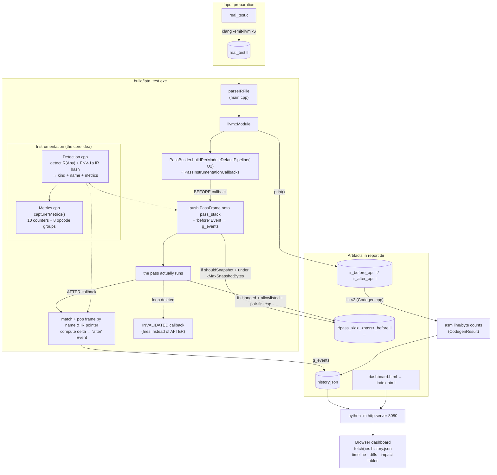
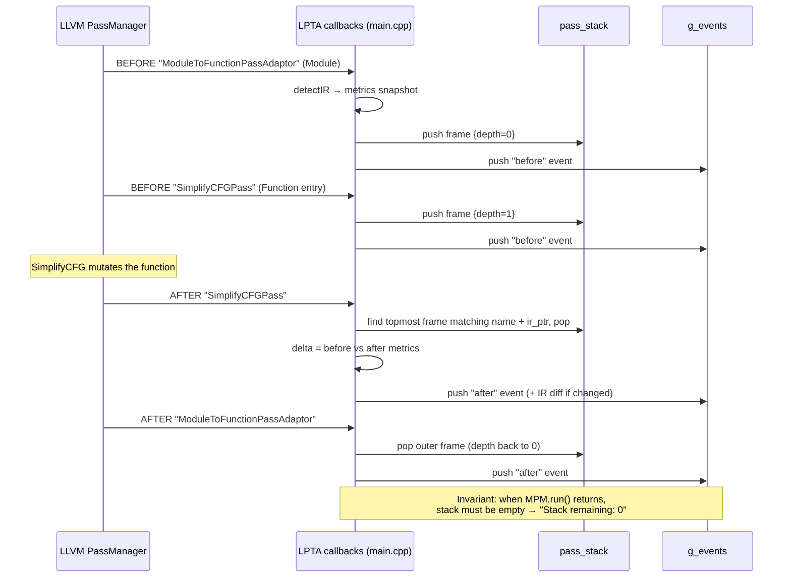
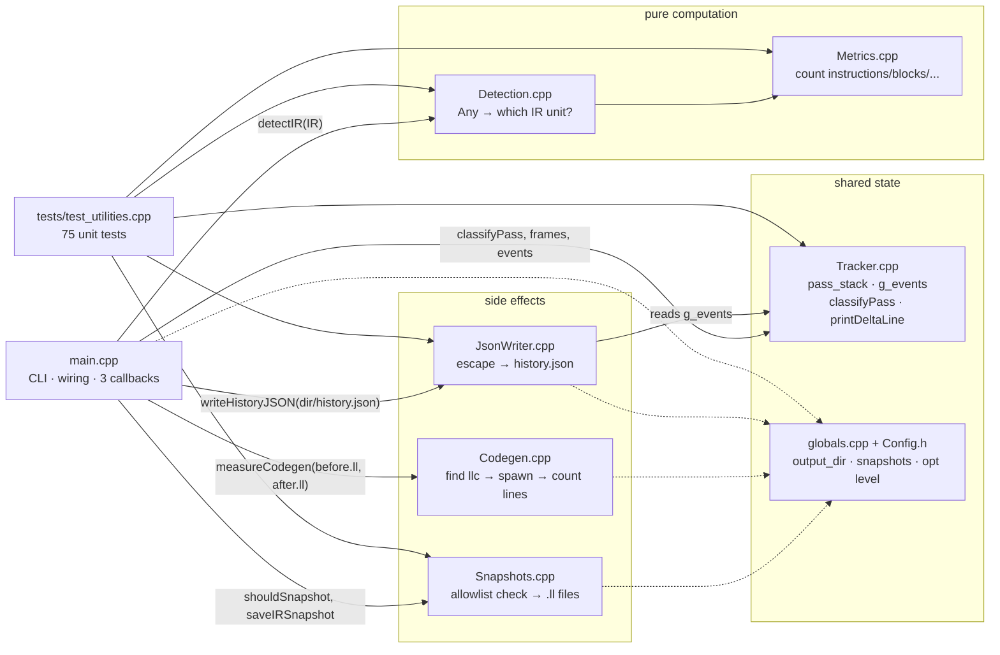

# LPTA — How Data Moves Through the Tool

> Render this file on GitHub, in VS Code (with a Mermaid preview extension),
> or open `index.html` in this folder for a styled browser view.

Three views, zooming inward:

1. **End-to-end pipeline** — disk to dashboard
2. **Anatomy of one pass execution** — callbacks and the frame stack
3. **File-level call map** — the actual source files

---

## 1. End-to-end pipeline

The whole tool in one picture. Blue = build/run steps, green = data artifacts,
orange = the instrumentation layer that makes LPTA what it is.



Key point: `pass_stack` is **transient** (alive only during `MPM.run`),
`g_events` is the **accumulated record**, and `history.json` is its
**serialization**. The dashboard never sees the stack — only events.

---

## 2. Anatomy of one pass execution

Why a *stack*, not a "current pass" variable: pipelines nest.
`ModuleToFunctionPassAdaptor` sits at depth 0 while real passes run deeper;
every BEFORE must pair with exactly one AFTER across that nesting.



The special case — a loop pass **deletes its own loop**: LLVM has no valid IR
object left to hand back, so it fires `AfterPassInvalidated` *instead of*
`AfterPass`. That's why INVALIDATED events carry metrics-before but no
after-state, and are matched by name alone (topmost, LIFO).

```
BEFORE(LICMPass on loop L)   → push
   ... loop L gets deleted ...
INVALIDATED(LICMPass)         → pop by name, emit "invalidated" event
```

---

## 3. File-level call map

Solid arrows = direct calls, dashed arrows = shared global state
(`inc/Config.h` + `src/globals.cpp`: `g_output_dir`, `g_snapshots`,
`g_opt_level`, optnone tracking).



Reading guide:

| Question you're asking | Follow the arrow into |
|---|---|
| Where do the numbers come from? | `Detection.cpp` → `Metrics.cpp` |
| Where is pass pairing enforced? | `main.cpp` callbacks + `Tracker.cpp` stack |
| Why does the dashboard show diffs? | `Snapshots.cpp` allowlist → `ir_before`/`ir_after` strings → `JsonWriter.cpp` |
| Where does asm size come from? | `Codegen.cpp` (`llc`, temp `.bat` on Windows, PATH fallback logic) |

---

## Cross-check these diagrams yourself

- Console run prints `[N] BEFORE/AFTER` lines with `depth=` — that's diagram 2 live.
- `report/history.json` `"summary"."total_before"/"total_after"` — diagram 1's event ledger.
- Doxygen call graphs (`docs/doxygen/html`) — diagram 3, machine-generated per function.
